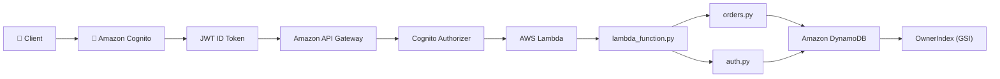
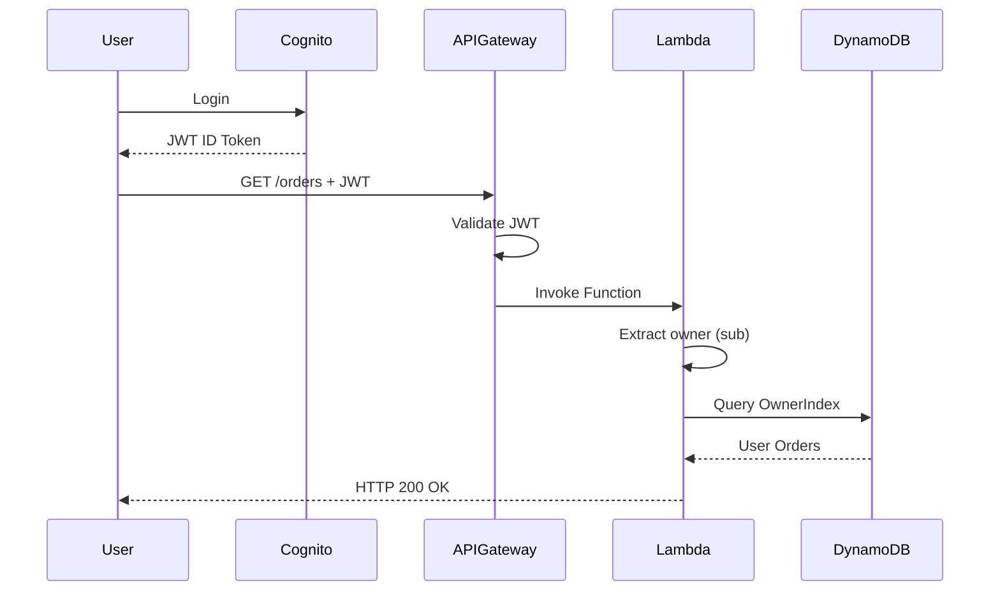

# 🚀 Order Processing API


A production-inspired serverless REST API built on AWS for managing customer orders.

The project was developed as a hands-on journey to learn cloud-native backend development while applying software engineering principles such as modular architecture, RESTful APIs, authentication, authorization and scalable NoSQL data modeling.

---

# 📖 Overview

Order Processing API is a cloud-native serverless backend built entirely on AWS.

The application demonstrates how to design secure REST APIs using Amazon Cognito, API Gateway, AWS Lambda and DynamoDB while following modern software engineering principles such as modular architecture, authentication, authorization and scalable NoSQL data modeling.

---

# ✨ Features

- ✅ Create Orders
- ✅ Retrieve a Single Order
- ✅ Retrieve Authenticated User Orders
- ✅ Update Order Status
- ✅ Order Workflow Validation
- ✅ Amazon Cognito Authentication
- ✅ JWT Authorization
- ✅ Owner-Based Authorization
- ✅ DynamoDB Global Secondary Index (GSI)
- ✅ CloudWatch Logging
- ✅ Modular Architecture

---

# 🏗 Architecture



---

# 🔄 Request Flow



---

# 📂 Project Structure

```text
order-processing-api/

├── lambda_function.py
├── orders.py
├── auth.py
├── constants.py
├── responses.py
├── README.md
└── function.zip
```

---

# ⚙️ Technologies

| Technology | Purpose |
|------------|---------|
| Python 3.12 | Backend Language |
| AWS Lambda | Serverless Compute |
| Amazon API Gateway | REST API |
| Amazon DynamoDB | NoSQL Database |
| Amazon Cognito | Authentication |
| JWT | Authorization |
| AWS IAM | Permissions |
| Amazon CloudWatch | Monitoring & Logging |
| AWS CLI | Infrastructure Management |
| Postman | API Testing |

---

# 🌐 API Endpoints

| Method | Endpoint | Description |
|---------|----------|-------------|
| POST | /orders | Create a new order |
| GET | /orders | Retrieve authenticated user's orders |
| GET | /orders/{id} | Retrieve a specific order |
| PUT | /orders/{id} | Update an order status |

---

# 🔐 Authentication & Authorization

Authentication is handled by **Amazon Cognito**.

API Gateway validates every JWT before invoking the Lambda function.

The backend automatically extracts the authenticated user's **Cognito Subject (`sub`)** and associates it with every newly created order.

The client never provides ownership information.

Users can:

- Create only their own orders
- Retrieve only their own orders
- Update only their own orders

Resources belonging to other users return:

```http
404 Not Found
```

instead of **403 Forbidden** to prevent resource enumeration.

---

# 🛡 Security

The API implements multiple security layers:

- JWT Authentication
- Amazon Cognito User Pools
- API Gateway Authorizer
- Owner-Based Authorization
- Resource Hiding (HTTP 404)
- Server-side Ownership Assignment
- Stateless Authentication

---

# 🔄 Order Workflow

```text
RECEIVED
     │
     ├────────────► CANCELLED
     │
     ▼
PROCESSING
     │
     ├────────────► CANCELLED
     │
     ▼
SHIPPED
     │
     ▼
DELIVERED
```

Invalid transitions return:

```http
400 Bad Request
```

---

# ⚡ DynamoDB Design

## Table

| Attribute | Type |
|-----------|------|
| Partition Key | order_id |

## Global Secondary Index

| Index | Partition Key |
|-------|---------------|
| OwnerIndex | owner |

The application retrieves user orders using a **Query** operation on the `OwnerIndex` instead of performing expensive table scans.

```python
table.query(
    IndexName="OwnerIndex",
    KeyConditionExpression=Key("owner").eq(owner)
)
```

This approach scales efficiently as the dataset grows.

---

# 🧠 Software Design

The project follows the **Single Responsibility Principle (SRP)**.

| Module | Responsibility |
|---------|----------------|
| lambda_function.py | Request Routing |
| orders.py | Business Logic |
| auth.py | Authentication Helpers |
| constants.py | Business Rules |
| responses.py | HTTP Response Generation |

Business logic is intentionally separated from routing and authentication to improve maintainability and scalability.

---

# 🚧 Roadmap

## ✅ Completed

- [x] Create Order
- [x] Retrieve Order
- [x] List Orders
- [x] Update Order
- [x] Order Workflow Validation
- [x] Amazon Cognito Authentication
- [x] JWT Authorization
- [x] Owner-Based Authorization
- [x] DynamoDB Global Secondary Index
- [x] CloudWatch Logging
- [x] Modular Architecture

## 🚀 Future Improvements

- [ ] React Frontend
- [ ] User Dashboard
- [ ] Order Details Page
- [ ] Pagination
- [ ] Search & Filtering
- [ ] Admin Role
- [ ] Unit Testing
- [ ] Integration Testing
- [ ] Docker Support
- [ ] CI/CD Pipeline
- [ ] Infrastructure as Code (AWS CDK / Terraform)

---

# 📚 Lessons Learned

Throughout the development of this project I gained practical experience with:

- Designing REST APIs with Amazon API Gateway
- Building serverless applications with AWS Lambda
- Data modeling in Amazon DynamoDB
- Designing efficient queries using Global Secondary Indexes
- Implementing JWT authentication with Amazon Cognito
- Owner-based authorization
- Secure API design
- Modular software architecture
- Cloud-native application development
- AWS CLI workflows

---

# 👨‍💻 Author

**Gabriele Aiello**

Cloud-native backend project developed for educational purposes with a strong focus on AWS serverless technologies, software engineering principles and secure API design.